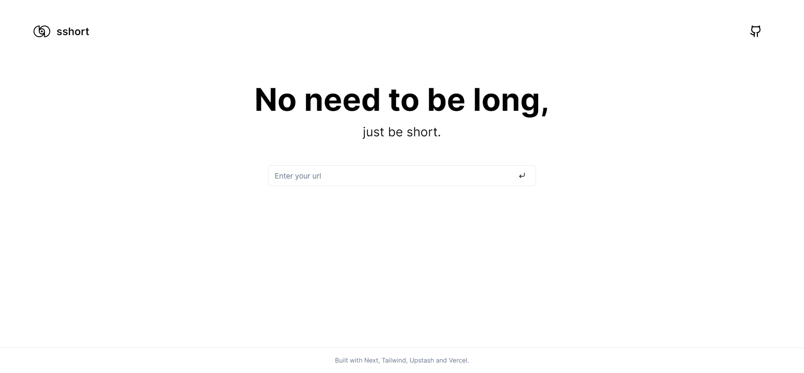

## sshort - a simple URL shortener

Url shortener built with Next, Tailwind, Upstash Redis and Vercel.

<!-- demo image -->


> No analytics, no tracking, no cookies, no ads, no bullshit. Just shortening.

### Features
The urls stores in a Redis database. And yours are in Local Storage. This makes the app blazing fast.


### Development
```bash
# Install dependencies
pnpm i
```

```bash
# Fill the .env file with your own values (check .env.example)
cp .env.example .env
```

```bash
# Run dev server
pnpm dev
```

```bash
# Build for production
pnpm build
```


Created by [stylessh](https://stylessh.dev) :)